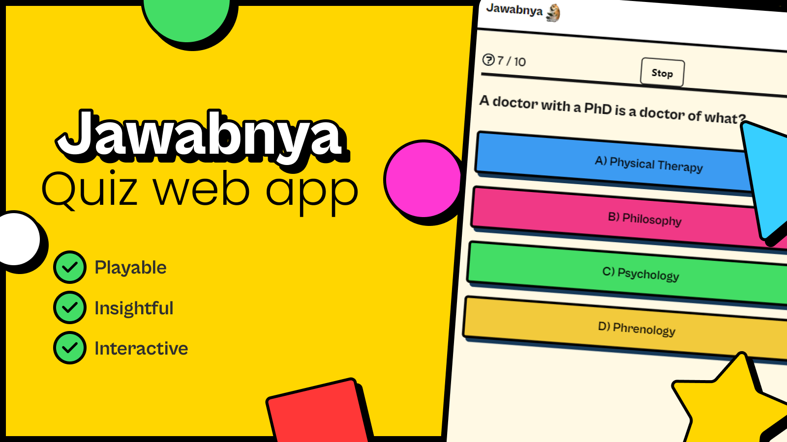
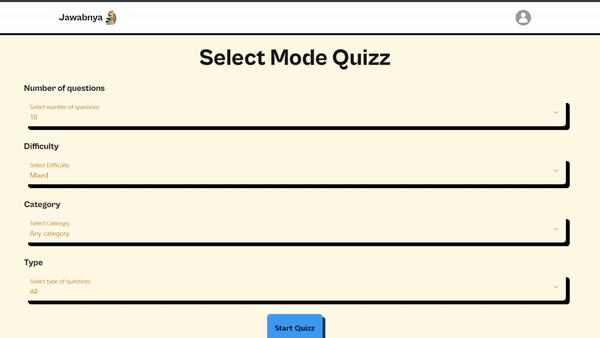

  <h1> Jawabnya</h1>
  <picture>
    <source media="(prefers-color-scheme: dark)" srcset="./screenshots/Jawabnya.png">
    
  </picture>
  

  Player quizz questions provided by <a href="https://opentdb.com" rel="nofollow">Open TDB</a>.
  

  <h2>
    <a href="https://jawabnya-quizz-871pcyuai-cakradarma.vercel.app/" rel="nofollow">Try Now!</a>
  </h2>

  Web-based application developed using React, Next UI, and Redux Toolkit. It offers an interactive quiz experience where players can answer a series of questions provided by the Open Trivia Database (Open TDB).

<li>
  Modern data fetching using React-Query
</li>
<li>
  Loading animation
</li>
<li>
  Local Storage Integration with Redux Toolkit
</li>
<li>
  Auto Closure of Questions When Timer Expires
</li>
<li>
  Implemented a mechanism using local storage to save the user's progress and quiz state when the browser is closed
</li>

  <h2>Preview</h2>
  <picture>
    <source media="(prefers-color-scheme: dark)" srcset="./screenshots/demo.gif">
    
  </picture>

