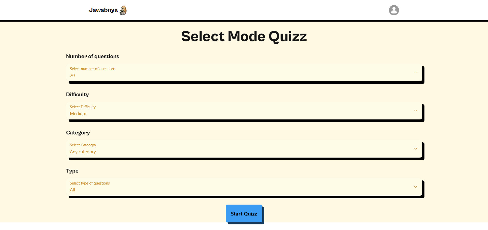
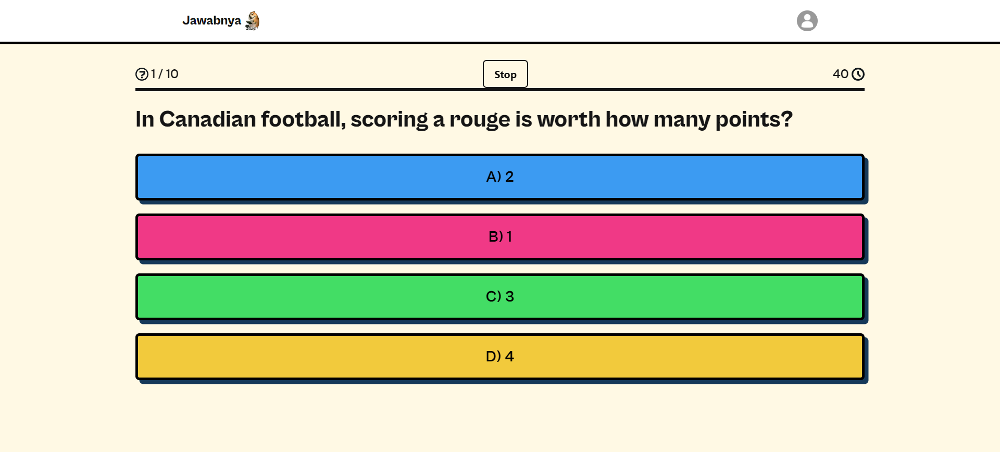
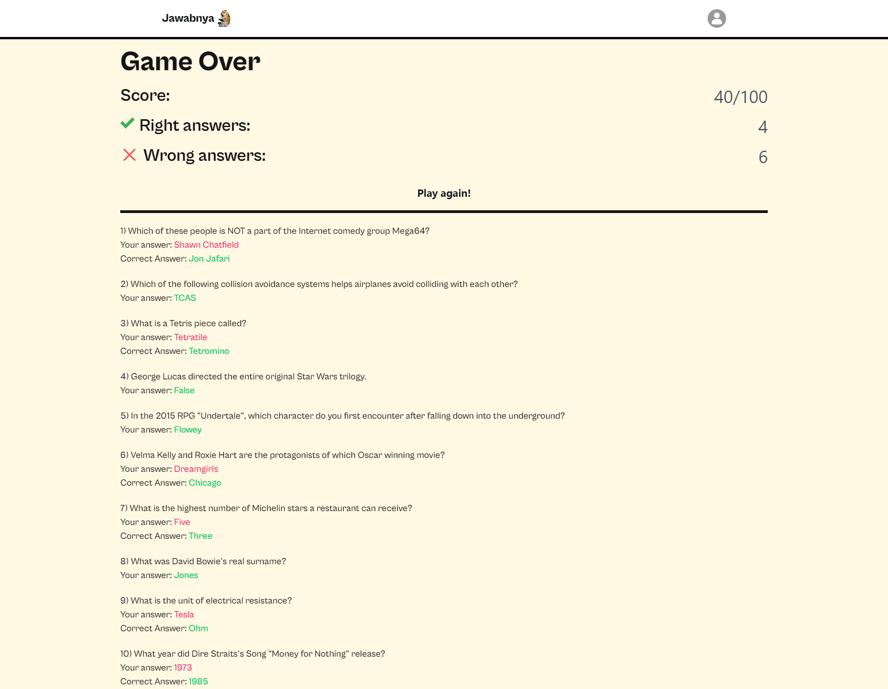

  <h1> Jawabnya</h1>

  

  Player quizz questions provided by <a href="https://opentdb.com" rel="nofollow">Open TDB</a>.
  

  <h2>
    <a href="https://jawabnya-quizz-871pcyuai-cakradarma.vercel.app/" rel="nofollow">Try Now!</a>
  </h2>

Web-based application developed using React, Next.js, Next UI, and Redux Toolkit. It offers an interactive quiz experience where players can answer a series of questions provided by the Open Trivia Database (Open TDB).

  <h2>Screenshots</h2>
  <picture>
    <source media="(prefers-color-scheme: dark)" srcset="./screenshots/1settings.png">
    
  </picture>
  <picture>
    <source media="(prefers-color-scheme: dark)" srcset="./screenshots/2game.png">
    
  </picture>
  <picture>
    <source media="(prefers-color-scheme: dark)" srcset="./screenshots/4results.png">
    
  </picture>

